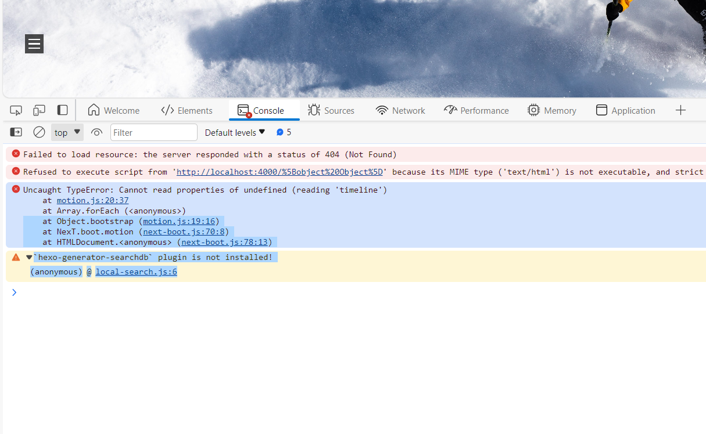
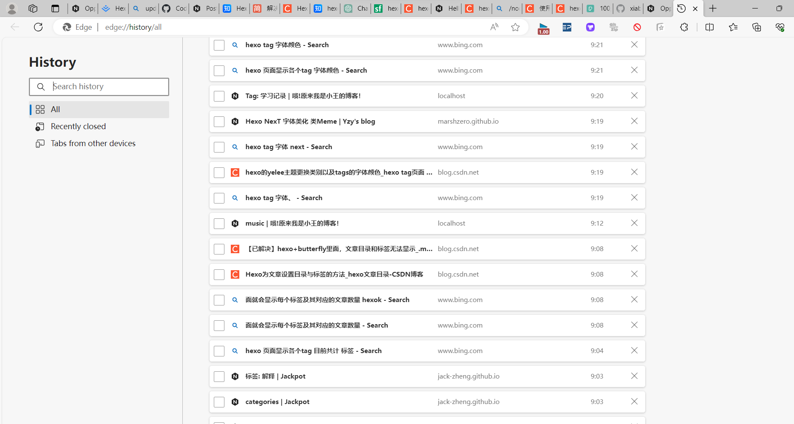
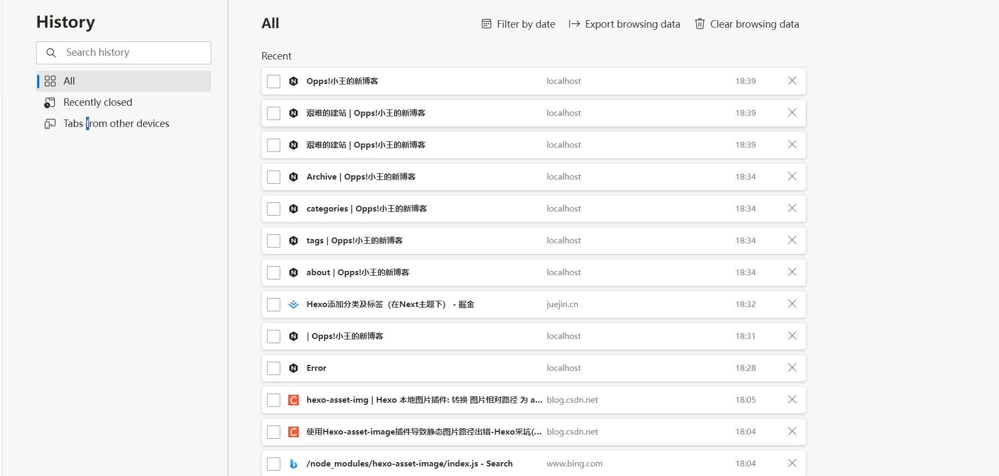

这个post为了是记录这个blog网站的成长和我更新的建站进度

<!--more-->

Welcome to [Hexo](https://hexo.io/)! This is your very first post. Check [documentation](https://hexo.io/docs/) for more info. If you get any problems when using Hexo, you can find the answer in [troubleshooting](https://hexo.io/docs/troubleshooting.html) or you can ask me on [GitHub](https://github.com/hexojs/hexo/issues).

# DAY 1  2024.2.1

## 我是小王，你好！

### Create a new post

``` bash
$ hexo new "My New Post"
```

https://hexo.io/docs/generating.html)

### Deploy to remote sites

* 这一天刚重启这个项目,本地换了next主题，粗略地优化了一下iu。分布了第一篇博客。

* 【手把手教你搭建属于自己的hexo+github博客】 https://www.bilibili.com/video/BV1cW411A7Jx/?share_source=copy_web&vd_source=a75cb83be5854ac5d9c7ceab449403cd

* [hexo博客配置 - 知乎 (zhihu.com)](https://www.zhihu.com/column/c_1629878808739393536)

  

## DAY 2 2024.2.2

* 弄明白了为什么https://xiabobobo.github.io 为什么连不上我的本地更新。因为我的GitHub仓库有两个brunch 经过大量查阅原来是github 把默认改成了main,我上传的仓库是master。把这个消息分享给我的朋友们。
* [关于hexo更新到GitHub后博客内容未变问题_hexo 部署到gitee 已经部署了 但是博客没更新-CSDN博客](https://blog.csdn.net/Lu_xiuyuan/article/details/112056997)

##  DAY 3 2024.2.3

* 加了背景，改了文章背景padding or margin ,然后学会了显示图片。
* hexo搭建博客后图片无法显示的完美解决_hexo博客图片不显示-CSDN博客](https://blog.csdn.net/weixin_43702620/article/details/118655308)

* [用Github Pages+Hexo搭建博客之(七)如何删除一篇已经发布的文章 #成功解决：同时删除掉.deploy_git文件夹_hexo 删除git-CSDN博客](https://blog.csdn.net/qq_34243930/article/details/109046120) 

## Day4  2024.2.4

 跟爹妈看电视剧，想着今天英语听力没听，感觉10天没有听了，有点后怕，赶紧更新一个新功能，然后记录每天学习英语听力的打卡

* [设置hexo首页只显示部分摘要（不显示全文） | Z Blog (yueyue200830.github.io)](https://yueyue200830.github.io/2020/02/23/设置hexo首页只显示部分摘要（不显示全文）/)

我发现每次更新贴文日期都会改变。

* 想吐，突然早上

  
* 然后我就从头开始了，想吐，啊啊啊啊啊啊啊啊啊啊啊啊啊啊啊

  

  



 我已经成为尸体了

